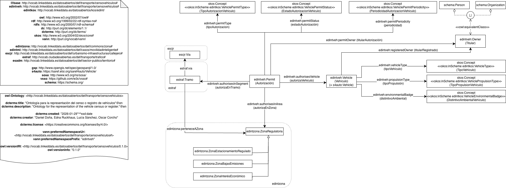

# Ontología para la representación del censo/registro de vehículos

Esta ontología permite representar el dominio del censo o registro de vehículos que muchas entidades locales gestionan para distintos propósitos (cobro del impuesto de vehículos de tracción mecánica - IVTM - y gestión de la movilidad dentro de la ciudad, entre otros). 

Está siendo desarrollada en el contexto del Espacio de Datos para las Infraestructuras Urbanas Inteligentes ([EDINT](https://edint.es/)). Asimismo, fue identificada como una ontología relevante para la representación de datos gestionados por entidades locales en la guía [Datos abiertos FEMP 2019: 40 conjuntos de datos a publicar por las Entidades Locales](http://femp.femp.es/files/3580-1937-fichero/DATOS%20ABIERTOS%20FEMP%202019.pdf), tal y como se describe también en la correspondiente nota de [datos.gob.es](https://datos.gob.es/es/conocimiento/datos-abiertos-femp-2019-40-conjuntos-de-datos-publicar-por-las-entidades-locales), y por tanto recogido en el [repositorio Github de apoyo a la iniciativa](https://github.com/opencitydata/vocab-transporte-censo-vehiculos), que queda deprecado una vez se lanza este repositorio.

# Propósito y alcance de la ontología (ontology purpose and scope)

El propósito de esta ontología es el de proporcionar un vocabulario común para la representación de las entidades y datos principales del censo o registro de vehículos. Su alcance se limita a los datos que pueden ser utilizados con los propósitos de cobro de impuestos por parte de las entidades locales o de gestión de la movilidad (permisos de aparcamiento, permisos de acceso a zonas específicas, etc.), que son parte de las funciones habituales de las entidades locales. Quedan fuera del alcance de la ontología otros aspectos relacionados con los vehículos, como pueden ser los datos de sus permisos de circulación, inspecciones técnicas, etc., que podrían ser objeto de una extensión de esta ontología o de su evolución en el futuro, si se considera relevante. 

# Prefijo y espacio de nombres (prefix and namespace)

El prefijo de esta ontologías es edint-veh. Se publica en el espacio de nombres: http://vocab.linkeddata.es/datosabiertos/def/transporte/censovehiculos# 

# Modelo conceptual (Ontology Conceptualization)

# Estructura del repositorio (Reposity structure)

El repositorio contiene las siguientes carpetas:

| Folder | Description |
|--------|--------------|
| **diagrams/** | Stores diagrams and other resources representing the conceptual model of the ontology (e.g., class hierarchies, relationships). |
| **documentation/** | Stores the HTML or human oriented documentation of the ontology and related artefacts. |
| **examples/** | Includes examples that demonstrate how to instantiate or apply the ontology in real data scenarios. |
| **kos/** | Stores controlled vocabularies or KOS implementation, usually SKOS implementations in rdf. |
| **ontology/** | Contains the actual ontology implementation files in formats such as `.owl`, `.rdf`, `.ttl`, or `.jsonld`. |
| **requirements/** | Contains all documents used to define the ontology’s requirements: data example, competency questions, functional requirements, use cases, etc. |
| **shapes/** | Contains the SHACL shapes used to define and validate ontology constraints. |

# Mantenimiento y evolución (maintenance and evolution)

To manage those incidents or suggested improvements with respect to the vocabulary, we recommend you to follow
the guides provided in [Issues Management](https://github.com/nombre-repositorio/wiki/issues-management) to
generate an issue (work in progress)

# Financiación (Funding)

Esta ontología ha sido desarrollada en el contexto del Espacio de Datos para las Infraestructuras Urbanas Inteligentes ([EDINT](https://edint.es/)). 

<<Completar con información global del proyecto y logos si es necesario>>.
